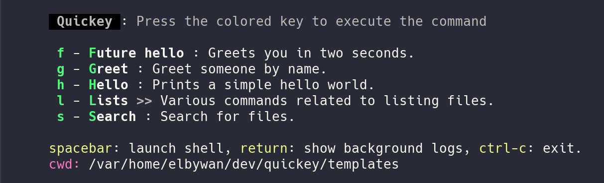

# Quickey

<div align="center">
  <h3>Shell commands at your fingertips ✌️</h3>
  
  <br>
  <h4>⚠️ Work in progress ⚠️</h4>
  <em>Heavily inspired by <a href="https://github.com/julienmoumne/hotshell">hotshell</a>.</em>
</div>

## Installation

```bash
npm install -g quickey
```

## Quick Start

1. Initialize a configuration file in your project:
```bash
quickey --init
```

2. Or use with your existing package.json (npm scripts will be automatically loaded):
```bash
cd your-project
quickey
```

## Configuration

Quickey supports multiple configuration formats:

### JavaScript (.quickey.js)
```javascript
export default function(q) {
  // Simple action
  q.action('hello')
    .description('Say hello')
    .shell('echo "Hello, World!"')

  // Action with user prompt
  q.action('greet')
    .description('Greet someone')
    .prompt('Enter a name')
    .shell('echo "Hello, {{input}}!"')

  // Action with named prompts
  q.action('deploy')
    .description('Deploy application')
    .prompt('env', 'Environment (dev/prod)')
    .prompt('version', 'Version number')
    .shell('deploy --env {{env}} --version {{version}}')

  // Category with nested actions
  q.category('dev')
    .description('Development commands')
    .content(q => {
      q.action('test').shell('npm test')
      q.action('build').shell('npm run build')
    })
}
```

### JSON (.quickey.json)
```json
[
  {
    "label": "hello",
    "description": "Say hello",
    "shell": "echo \"Hello, World!\""
  },
  {
    "label": "greet",
    "description": "Greet someone",
    "prompt": "Enter a name",
    "shell": "echo \"Hello, {{input}}!\""
  },
  {
    "label": "deploy",
    "description": "Deploy application",
    "prompts": [
      { "name": "env", "message": "Environment (dev/prod)" },
      { "name": "version", "message": "Version number" }
    ],
    "shell": "deploy --env {{env}} --version {{version}}"
  }
]
```

### YAML (.quickey.yaml or .quickey.yml)
```yaml
- label: hello
  description: Say hello
  shell: echo "Hello, World!"

- label: greet
  description: Greet someone
  prompt: "Enter a name"
  shell: "echo \"Hello, {{input}}!\""

- label: deploy
  description: Deploy application
  prompts:
    - name: env
      message: "Environment (dev/prod)"
    - name: version
      message: "Version number"
  shell: "deploy --env {{env}} --version {{version}}"
```

## User Prompts

Quickey supports prompting users for input before executing commands. Use placeholders like `{{name}}` in your shell commands to inject user input.

### Text Prompts (JavaScript)
```javascript
// Unnamed prompt - uses {{input}} placeholder
action.prompt('Enter package name')
  .shell('npm install {{input}}')

// Named prompt - uses {{package}} placeholder
action.prompt('package', 'Enter package name')
  .shell('npm install {{package}}')

// Multiple text prompts
action
  .prompt('env', 'Environment')
  .prompt('version', 'Version')
  .shell('deploy --env {{env}} --version {{version}}')
```

### Select Prompts
```javascript
// Choose from a list of options
action
  .select('env', 'Choose environment', ['dev', 'staging', 'prod'])
  .shell('deploy --env {{env}}')

action
  .select('region', 'Select region', ['us-east', 'us-west', 'eu-central'])
  .select('size', 'Instance size', ['small', 'medium', 'large'])
  .shell('provision --region {{region}} --size {{size}}')
```

### Confirmation Prompts
```javascript
// Yes/No confirmation (default: false)
action
  .confirm('proceed', 'Deploy to production?')
  .shell('echo {{proceed}} && deploy')

// With default value (true)
action
  .confirm('backup', 'Create backup before deployment?', true)
  .shell('[ "{{backup}}" = "true" ] && backup.sh; deploy.sh')
```

### Password Prompts
```javascript
// Hidden input for sensitive data
action
  .password('token', 'API Token')
  .shell('curl -H "Authorization: Bearer {{token}}" https://api.example.com')

action
  .prompt('username', 'Username')
  .password('password', 'Password')
  .shell('login --user {{username}} --pass {{password}}')
```

### Mixed Prompt Types
```javascript
// Combine different prompt types
action
  .prompt('name', 'Project name')
  .select('type', 'Project type', ['web', 'mobile', 'desktop'])
  .confirm('git', 'Initialize git repository?', true)
  .password('token', 'GitHub token (optional)')
  .shell('create-project --name {{name}} --type {{type}}')
```

### Prompts in JSON/YAML
```json
{
  "label": "install",
  "prompt": "Package name",
  "shell": "npm install {{input}}"
}
```

```json
{
  "label": "deploy",
  "prompts": [
    { "name": "env", "message": "Environment", "type": "select", "options": ["dev", "prod"] },
    { "name": "confirm", "message": "Proceed?", "type": "confirm", "default": false }
  ],
  "shell": "deploy --env {{env}}"
}
```

## Command Confirmation

Add a safety confirmation gate before executing potentially dangerous commands. Unlike `confirm()` prompts which capture user input, `requireConfirmation()` acts as a final safety check before command execution.

### Basic Confirmation
```javascript
// Require confirmation for destructive operations
action
  .requireConfirmation('Are you sure you want to delete all data?')
  .shell('rm -rf data/')

// With default value (defaults to false)
action
  .requireConfirmation('Proceed with deployment?', true)
  .shell('npm run deploy')
```

### With User Prompts
```javascript
// Confirmation message can use prompt placeholders
action
  .prompt('env', 'Environment')
  .requireConfirmation('Deploy to {{env}}? This cannot be undone!')
  .shell('deploy --env {{env}}')

action
  .select('database', 'Select database', ['dev', 'staging', 'prod'])
  .requireConfirmation('Reset {{database}} database? All data will be lost!')
  .shell('psql -c "DROP DATABASE {{database}}; CREATE DATABASE {{database}}"')
```

### Common Use Cases
```javascript
// Database operations
action('reset-db')
  .requireConfirmation('Reset database? This cannot be undone!')
  .shell('npm run db:reset')

// Deployment to production
action('deploy-prod')
  .requireConfirmation('Deploy to production?', false)
  .shell('npm run deploy:production')

// Force push to git
action('force-push')
  .prompt('branch', 'Branch name')
  .requireConfirmation('Force push to {{branch}}? This will overwrite remote history!')
  .shell('git push origin {{branch}} --force')

// File deletion
action('clean')
  .requireConfirmation('Delete all build artifacts?', false)
  .shell('rm -rf dist/ build/ node_modules/')
```

## Command Chaining

Chain multiple commands to execute sequentially with automatic error handling. Commands execute based on the exit code of the previous command.

### Basic Chaining with then()
```javascript
// Chain commands that run sequentially on success
action('build-and-test')
  .shell('npm run build')
  .then('npm test')
  .then('npm run lint')
  .then('echo "All checks passed!"')

// Chain JavaScript functions
action('deploy')
  .shell('git pull')
  .then(() => console.log('Code updated!'))
  .then('npm install')
  .then('npm run build')
```

### Error Handling with onError()
```javascript
// Execute commands only if previous command fails
action('deploy')
  .shell('npm run deploy')
  .onError('npm run rollback')
  .onError(() => console.error('Deployment failed!'))

// Mix success and error handlers
action('migrate')
  .shell('npm run db:backup')
  .then('npm run db:migrate')
  .onError('npm run db:restore')
  .then('echo "Migration complete!"')
```

### Complex Workflows
```javascript
// Build pipeline with error recovery
action('ci-pipeline')
  .shell('npm run build')
  .then('npm test')
  .then('npm run coverage')
  .onError('echo "Tests failed - cleaning up"')
  .onError('npm run clean')

// Deployment with rollback
action('prod-deploy')
  .prompt('version', 'Version to deploy')
  .requireConfirmation('Deploy v{{version}} to production?')
  .shell('git pull origin main')
  .then('npm install')
  .then('npm run build')
  .then('pm2 restart app')
  .then('npm run verify-deployment')
  .onError('git reset --hard HEAD~1')
  .onError('pm2 restart app')
  .onError('echo "Deployment rolled back"')

// Database operations
action('reset-db')
  .select('env', 'Environment', ['dev', 'staging'])
  .requireConfirmation('Reset {{env}} database?')
  .shell('npm run db:backup')
  .then('npm run db:reset')
  .then('npm run db:seed')
  .then(() => console.log('Database reset complete'))
  .onError('npm run db:restore')
```

### How Chaining Works
- **then()**: Executes only if the previous command exits with code 0 (success)
- **onError()**: Executes only if the previous command exits with non-zero code (failure)
- Chains stop executing at the first failure (unless using onError handlers)
- Error handlers don't stop the chain - subsequent then() handlers still run if an error handler succeeds
- Works with both shell commands and JavaScript functions
- Note: Chaining is not supported with async commands

## Conditional Actions

Show or hide actions and categories dynamically based on runtime conditions like environment variables, file existence, or command availability. Conditions are evaluated each time the menu is displayed.

### Basic Conditions

```javascript
// Show only in development mode
action('dev-server')
  .shell('npm run dev')
  .condition(() => process.env.NODE_ENV === 'development')

// Show only when Docker is installed
action('docker-compose')
  .shell('docker-compose up')
  .condition(() => {
    try {
      require('child_process').execSync('command -v docker', { stdio: 'ignore' })
      return true
    } catch {
      return false
    }
  })

// Show only when a file exists
action('migrate')
  .shell('npm run migrate')
  .condition(() => require('fs').existsSync('migrations'))
```

### Condition Helpers

Quickey provides helper functions for common condition checks:

```javascript
import { 
  envExists, 
  envEquals, 
  fileExists, 
  commandExists,
  commandSucceeds,
  not, 
  and, 
  or 
} from 'quickey'

// Check environment variables
action('deploy-prod')
  .shell('npm run deploy')
  .condition(envEquals('NODE_ENV', 'production'))

action('staging-only')
  .shell('npm run deploy:staging')
  .condition(envExists('STAGING_KEY'))

// Check file/directory existence
action('run-migrations')
  .shell('npm run migrate')
  .condition(fileExists('migrations/pending'))

action('build-docker')
  .shell('docker build .')
  .condition(fileExists('Dockerfile'))

// Check command availability
action('git-push')
  .shell('git push')
  .condition(commandExists('git'))

action('deploy-heroku')
  .shell('git push heroku main')
  .condition(commandExists('heroku'))

// Check if command succeeds (exit code 0)
action('git-status')
  .shell('git status')
  .condition(commandSucceeds('git rev-parse --git-dir'))

// Use in categories
category('Docker Commands')
  .condition(commandExists('docker'))
  .content(q => {
    q.action('up').shell('docker-compose up')
    q.action('down').shell('docker-compose down')
  })
```

### Logical Operators

Combine multiple conditions using logical operators:

```javascript
// NOT - Invert a condition
action('setup-env')
  .shell('cp .env.example .env')
  .condition(not(fileExists('.env')))

// AND - All conditions must be true
action('deploy')
  .shell('npm run deploy')
  .condition(and(
    envEquals('NODE_ENV', 'production'),
    fileExists('dist'),
    commandExists('aws')
  ))

// OR - At least one condition must be true
action('test')
  .shell('npm test')
  .condition(or(
    envEquals('NODE_ENV', 'development'),
    envEquals('NODE_ENV', 'test')
  ))

// Complex nested conditions
action('prod-deploy')
  .shell('npm run deploy:production')
  .condition(and(
    or(
      envEquals('CI', 'true'),
      envEquals('NODE_ENV', 'production')
    ),
    fileExists('dist/bundle.js'),
    not(fileExists('.maintenance'))
  ))
```

### Practical Examples

```javascript
export default function(q) {
  // Development-only commands
  action('hot-reload')
    .shell('npm run dev')
    .condition(envEquals('NODE_ENV', 'development'))

  // Production-only commands
  action('deploy')
    .requireConfirmation('Deploy to production?')
    .shell('npm run deploy')
    .condition(and(
      envEquals('NODE_ENV', 'production'),
      fileExists('dist')
    ))

  // Git operations (only in git repos)
  category('Git')
    .condition(commandSucceeds('git rev-parse --git-dir'))
    .content(q => {
      q.action('status').shell('git status')
      q.action('pull').shell('git pull')
      q.action('push').shell('git push')
    })

  // Docker commands (only when Docker is available)
  category('Docker')
    .condition(commandExists('docker'))
    .content(q => {
      q.action('ps').shell('docker ps')
      q.action('compose up').shell('docker-compose up -d')
      q.action('compose down').shell('docker-compose down')
    })

  // Show initialization wizard only when not configured
  action('setup')
    .shell('npm run setup')
    .condition(not(fileExists('.env')))

  // Platform-specific commands
  action('open-app')
    .shell(process.platform === 'darwin' ? 'open .' : 'xdg-open .')
    .condition(() => ['darwin', 'linux'].includes(process.platform))

  // Conditional on multiple factors
  action('backup-and-deploy')
    .shell('npm run backup && npm run deploy')
    .condition(and(
      envEquals('NODE_ENV', 'production'),
      fileExists('backups'),
      commandExists('rsync'),
      not(fileExists('.maintenance'))
    ))
}
```

### How Conditions Work
- Conditions are evaluated every time the menu is rendered
- If a condition returns `false`, the action/category is hidden from the menu
- If a condition throws an error, the item is hidden (fail-safe behavior)
- Conditions don't affect execution - they only control visibility
- Use conditions with prompts, confirmations, and chaining for powerful workflows

## Environment Variables

Set custom environment variables for your shell commands. Environment variables are merged with `process.env` and passed to all shell commands, including chained commands.

### Basic Usage

```javascript
// Set a single environment variable
action('deploy')
  .env('NODE_ENV', 'production')
  .shell('npm run build')

// Set multiple environment variables
action('test')
  .env({
    NODE_ENV: 'test',
    DEBUG: 'true',
    LOG_LEVEL: 'verbose'
  })
  .shell('npm test')

// Chain multiple env() calls
action('build')
  .env('NODE_ENV', 'production')
  .env('OPTIMIZE', 'true')
  .env('SOURCE_MAP', 'false')
  .shell('npm run build')
```

### Dynamic Values from Prompts

Environment variables can use prompt placeholders that are replaced with user input:

```javascript
// Single dynamic value
action('deploy')
  .prompt('environment', 'Target environment')
  .env('DEPLOY_ENV', '{{environment}}')
  .shell('deploy.sh')  // deploy.sh can access $DEPLOY_ENV

// Multiple dynamic values
action('provision')
  .prompt('region', 'AWS Region')
  .prompt('size', 'Instance size')
  .env({
    AWS_REGION: '{{region}}',
    INSTANCE_SIZE: '{{size}}',
    APP_NAME: 'my-app'  // Static value
  })
  .shell('terraform apply')

// With select prompts
action('deploy')
  .select('env', 'Environment', ['dev', 'staging', 'prod'])
  .select('region', 'Region', ['us-east', 'us-west', 'eu-central'])
  .env({
    DEPLOY_ENV: '{{env}}',
    DEPLOY_REGION: '{{region}}'
  })
  .shell('deploy.sh')

// Complex placeholder patterns
action('connect-db')
  .prompt('host', 'Database host')
  .prompt('port', 'Database port')
  .prompt('dbname', 'Database name')
  .password('password', 'Database password')
  .env('DATABASE_URL', 'postgres://user:{{password}}@{{host}}:{{port}}/{{dbname}}')
  .shell('psql $DATABASE_URL')
```

### With Command Chaining

Environment variables are automatically passed to all chained commands:

```javascript
// Env vars available in all chains
action('ci-pipeline')
  .env({
    NODE_ENV: 'test',
    CI: 'true',
    COVERAGE_REPORT: './coverage'
  })
  .shell('npm run build')
  .then('npm test')
  .then('npm run coverage')
  .onError('npm run cleanup')
  // All commands above have access to NODE_ENV, CI, and COVERAGE_REPORT

// Combine with prompts and chaining
action('deploy-pipeline')
  .select('env', 'Environment', ['staging', 'production'])
  .prompt('version', 'Version tag')
  .env({
    DEPLOY_ENV: '{{env}}',
    DEPLOY_VERSION: '{{version}}',
    BUILD_ID: Date.now().toString()
  })
  .requireConfirmation('Deploy v{{version}} to {{env}}?')
  .shell('npm run build')
  .then('npm run test')
  .then('deploy.sh')
  .onError('rollback.sh')
```

### Common Use Cases

```javascript
// API deployments with credentials
action('api-deploy')
  .password('apiKey', 'API Key')
  .env({
    API_KEY: '{{apiKey}}',
    API_URL: 'https://api.production.com',
    TIMEOUT: '30000'
  })
  .shell('npm run deploy')

// Build with environment-specific configuration
action('build')
  .select('target', 'Build target', ['development', 'production'])
  .env({
    NODE_ENV: '{{target}}',
    OPTIMIZE: '{{target}}' === 'production' ? 'true' : 'false',
    SOURCE_MAP: '{{target}}' === 'development' ? 'inline' : 'hidden'
  })
  .shell('webpack build')

// Override system environment variables
action('custom-path')
  .env('PATH', '/usr/local/custom/bin:' + process.env.PATH)
  .shell('my-custom-command')

// Database operations
action('migrate')
  .select('env', 'Environment', ['dev', 'staging', 'prod'])
  .password('dbPassword', 'Database password')
  .env({
    DB_HOST: 'db.{{env}}.example.com',
    DB_USER: 'admin',
    DB_PASS: '{{dbPassword}}',
    DB_NAME: 'app_{{env}}'
  })
  .requireConfirmation('Run migrations on {{env}}?')
  .shell('npm run migrate')

// CI/CD pipelines
action('release')
  .prompt('version', 'Release version')
  .confirm('createTag', 'Create git tag?', true)
  .env({
    RELEASE_VERSION: '{{version}}',
    CREATE_TAG: '{{createTag}}',
    BUILD_NUMBER: process.env.CI_BUILD_NUMBER || 'local',
    COMMIT_SHA: process.env.GIT_COMMIT || 'unknown'
  })
  .shell('npm run build')
  .then('npm run package')
  .then('[ "$CREATE_TAG" = "true" ] && git tag v$RELEASE_VERSION')
  .then('npm publish')
```

### How Environment Variables Work
- Custom env vars are merged with `process.env` before command execution
- Custom values override existing environment variables
- Prompt placeholders (`{{name}}`) are replaced before execution
- Env vars are passed to all shell commands (primary and chained)
- Env vars are only available to shell commands, not JavaScript actions
- The original `process.env` remains unchanged

## Lifecycle Hooks

Execute code before or after your main commands using lifecycle hooks. This is useful for setup, cleanup, logging, and verification tasks.

### Before Hooks

Run commands before the main action executes:

```javascript
export default function(q) {
  // Setup before build
  q.action('Build')
    .before('mkdir -p dist')
    .before('rm -rf dist/*')
    .shell('npm run build')

  // Fetch before deployment
  q.action('Deploy')
    .before('git fetch')
    .before(() => console.log('Deploying...'))
    .shell('kubectl apply -f deployment.yaml')
}
```

### After Hooks

Run commands after the main action and all chains complete:

```javascript
export default function(q) {
  // Cleanup after build
  q.action('Build')
    .shell('npm run build')
    .after('npm run minify')
    .after('echo "Build complete!"')

  // Verify after deployment
  q.action('Deploy')
    .shell('kubectl apply -f deployment.yaml')
    .after('kubectl rollout status deployment')
    .after((exitCode) => {
      if (exitCode === 0) {
        console.log('Deployment successful!')
      } else {
        console.error('Deployment failed!')
      }
    })
}
```

### Hook Execution Order

Hooks execute in this order:

1. **Before hooks** (in order they were added)
2. **Main command** (shell or javascript)
3. **Chained commands** (then/onError)
4. **After hooks** (in order they were added)

```javascript
export default function(q) {
  q.action('Full Pipeline')
    .before('setup1')      // 1. First before hook
    .before('setup2')      // 2. Second before hook
    .shell('main-command') // 3. Main command
    .then('next-command')  // 4. Chained command
    .after('cleanup1')     // 5. First after hook
    .after('cleanup2')     // 6. Second after hook
}
```

### Hooks with JavaScript

Both shell commands and JavaScript functions are supported:

```javascript
export default function(q) {
  q.action('Test with Logs')
    .before(() => console.log('Starting tests...'))
    .before('docker-compose up -d')
    .shell('npm test')
    .after('docker-compose down')
    .after((exitCode) => {
      console.log(`Tests finished with exit code: ${exitCode}`)
    })
}
```

### Common Use Cases

**Build Pipeline:**
```javascript
q.action('Build Production')
  .before('mkdir -p dist')
  .before('rm -rf dist/*')
  .shell('npm run build')
  .then('npm run minify')
  .after('npm run size-report')
  .after(() => console.log('Build complete!'))
```

**Database Migration:**
```javascript
q.action('Migrate Database')
  .before('npm run db:backup')
  .before(() => console.log('Running migrations...'))
  .shell('npm run db:migrate')
  .onError('npm run db:restore')
  .after((code) => {
    if (code === 0) {
      console.log('Migration successful')
    } else {
      console.error('Migration failed, restored backup')
    }
  })
```

**Testing with Environment:**
```javascript
q.action('Integration Tests')
  .before('docker-compose up -d')
  .before('sleep 5')
  .before(() => console.log('Test environment ready'))
  .shell('npm run test:integration')
  .after('docker-compose down')
  .after('rm -rf .test-data')
```

**Deployment with Verification:**
```javascript
q.action('Deploy to Production')
  .before('git fetch')
  .before(() => console.log('Checking requirements...'))
  .shell('kubectl apply -f deployment.yaml')
  .then('kubectl rollout status deployment')
  .after('kubectl get pods')
  .after((code) => {
    if (code === 0) console.log('✓ Deployment successful!')
  })
```

### Hook Behavior

- **Before hooks** run before prompts, confirmation, and the main command
- **After hooks** receive the final exit code (for JavaScript hooks)
- **After hooks** always run, even if the main command or chains fail
- **Async commands** don't support after hooks (since they run in background)
- Hooks work with all other features (prompts, env vars, chaining, etc.)
- Shell hooks support `options` parameter for custom execution settings

## Search and Filter

Quickly find actions by searching through labels and descriptions. Press `/` to enter search mode, then type to filter commands in real-time.

### Basic Search

```javascript
// When you have many actions, use search to find them quickly
export default function(q) {
  // Imagine you have 50+ actions...
  q.action('Build Frontend').description('Build React application')
  q.action('Build Backend').description('Build Node.js API')
  q.action('Build Docker').description('Build Docker images')
  q.action('Test Frontend').description('Run React tests')
  q.action('Test Backend').description('Run API tests')
  q.action('Deploy Production').description('Deploy to production')
  q.action('Deploy Staging').description('Deploy to staging')
  // ... many more actions
}

// Press '/' and type 'docker' to show only Docker-related actions
// Press '/' and type 'frontend' to show only frontend actions
// Press 'ESC' to exit search mode
```

### Search Behavior

**Entering Search Mode:**
- Press `/` to activate search mode
- A search prompt appears at the top of the screen
- The menu updates in real-time as you type

**Searching:**
- Search matches against both action labels and descriptions
- Matching is case-insensitive
- Partial matches are supported (e.g., "doc" matches "Docker", "Documentation")
- Multiple words in labels/descriptions are all searchable

**Executing Actions:**
- Press `Enter` to execute the first matching action
- Press the action's key to execute that specific action
- Press `ESC` to exit search mode without executing

**During Search Mode:**
- Type any character to add it to your search query
- Press `Backspace` to remove the last character
- Regular command keys (spacebar, return for logs, etc.) are disabled
- Only matching actions are displayed in the menu

### Search Examples

```javascript
// Example: Large project with many scripts
export default function(q) {
  // Database commands
  q.action('DB Migrate').description('Run database migrations')
  q.action('DB Seed').description('Seed database with test data')
  q.action('DB Reset').description('Reset database')
  q.action('DB Backup').description('Backup production database')
  
  // Build commands
  q.action('Build Prod').description('Production build')
  q.action('Build Dev').description('Development build')
  q.action('Build Docs').description('Build documentation site')
  
  // Test commands
  q.action('Test Unit').description('Run unit tests')
  q.action('Test Integration').description('Run integration tests')
  q.action('Test E2E').description('Run end-to-end tests')
  
  // Deploy commands
  q.action('Deploy AWS').description('Deploy to AWS')
  q.action('Deploy Azure').description('Deploy to Azure')
  q.action('Deploy GCP').description('Deploy to Google Cloud')
}

// Usage:
// '/' then 'db' → Shows only database commands
// '/' then 'test' → Shows only test commands
// '/' then 'prod' → Shows "Build Prod" and "DB Backup" (matches description)
// '/' then 'aws' → Shows "Deploy AWS"
```

### Search with Categories

Search works across all actions in the current category:

```javascript
export default function(q) {
  q.category('Docker').content(q => {
    q.action('Build Image').description('Build Docker image')
    q.action('Push Image').description('Push to registry')
    q.action('Run Container').description('Run Docker container')
    q.action('Stop Container').description('Stop running container')
    q.action('View Logs').description('View container logs')
    q.action('Clean Images').description('Remove unused images')
  })
}

// Inside the "Docker" category:
// '/' then 'container' → Shows "Run Container" and "Stop Container"
// '/' then 'image' → Shows "Build Image", "Push Image", "Clean Images"
```

### Tips for Searchable Actions

**Good action naming for searchability:**

```javascript
// ✓ Good - descriptive labels and descriptions
q.action('Test E2E').description('Run end-to-end tests with Playwright')
q.action('Deploy Prod').description('Deploy to production environment')
q.action('DB Migrate').description('Run database schema migrations')

// ✗ Less searchable - vague or missing descriptions
q.action('Test').description('Tests')
q.action('Deploy')
q.action('Migrate').description('Do migration')
```

**Include relevant keywords in descriptions:**

```javascript
// Searching for 'docker', 'container', or 'kubernetes' will all match this
q.action('Build').description('Build Docker container for Kubernetes deployment')

// Searching for 'api', 'server', or 'backend' will match
q.action('Start').description('Start API server for backend development')
```

### How Search Works

- Search filters items based on query matching label or description
- Filtering happens in real-time as you type
- Conditional items (with `condition()`) are still filtered by conditions first
- Search query is case-insensitive and matches partial strings
- Whitespace is automatically trimmed from search queries
- Empty search shows all available actions

## Command History

Quickey automatically tracks all executed commands and allows you to quickly re-run them from a history menu.

### Accessing History

Press `h` at any time to view your command history:

- Recent commands are shown first
- Each entry displays: exit status (✓/✗), type ($/js), execution time, and command
- Select any entry to re-run it
- History persists during the current session (up to 50 most recent commands)

### Example History Display

```
✓ [$] 14:32:15 - npm run build
✗ [$] 14:31:42 - npm test
✓ [js] 14:30:10 - Log message
✓ [$] 14:28:33 - git status
```

### History Features

**Automatic Tracking:**
```javascript
export default function(q) {
  // All shell commands are tracked
  q.action('Build')
    .shell('npm run build')
  
  // JavaScript actions are tracked too
  q.action('Log Info')
    .javascript(() => console.log('Info'))
}
```

**Quick Re-run:**
- Press `h` to view history
- Navigate to any command
- Press Enter to execute it again
- Shell commands run with their original command
- JavaScript actions show an info message (functions can't be re-run)

**Exit Code Tracking:**
```
✓ - Command succeeded (exit code 0)
✗ - Command failed (exit code non-zero)
```

**Command Types:**
```
[$]  - Shell command
[js] - JavaScript action
```

### History Behavior

- **Capacity**: Stores up to 50 most recent commands
- **Ordering**: Most recent commands appear first
- **Session-based**: History is cleared when you exit Quickey
- **Smart tracking**: Only actual command executions are tracked (not menu navigation)
- **Exit codes**: Shows success/failure status for each command
- **Timestamps**: Shows exact execution time for each command

### Visibility

The `h` key only appears when:
- You're not in search mode (press `ESC` to exit search first)
- There's at least one command in history
- You're at the root menu or in a category

### Use Cases

**Debugging:**
```javascript
// Run a failing test multiple times
// - Execute: npm test
// - Check output
// - Make code changes
// - Press 'h' and re-run the test
// - Repeat until fixed
```

**Development Workflow:**
```javascript
// Typical cycle:
// 1. npm run build (✓)
// 2. npm test (✗ - failed)
// 3. Fix code
// 4. Press 'h' to access history
// 5. Re-run build
// 6. Re-run test
```

**Comparing Outputs:**
```javascript
// Run same command with different conditions
// - Execute command once
// - Change environment or code
// - Press 'h' and re-run
// - Compare results
```

### Tips

- Use history to quickly repeat long commands without navigating menus
- Check exit codes (✓/✗) to see which commands succeeded or failed
- History is especially useful during debugging sessions
- JavaScript functions can't be re-executed from history (only shell commands)
- History is session-specific and doesn't persist across Quickey restarts

### How Command History Works

1. **Tracking**: Every command execution is automatically recorded
2. **Storage**: History entries include timestamp, label, command, type, and exit code
3. **Display**: Press `h` to see a menu of recent commands
4. **Re-execution**: Selecting a history entry re-runs the command
5. **Limits**: Oldest entries are automatically removed when limit (50) is reached

## Working Directory

Change the working directory temporarily for command execution. The directory is automatically restored after the action completes, including all chains and hooks.

### Basic Usage

```javascript
// Execute command in a specific directory
action('Build Project')
  .in('/path/to/project')
  .shell('npm run build')

// Use relative paths (relative to current directory)
action('Test Module')
  .in('./packages/core')
  .shell('npm test')

// Navigate up directories
action('Run Root Script')
  .in('../../')
  .shell('./script.sh')

// Chain with other methods
action('Deploy')
  .in('/var/www/app')
  .shell('git pull')
  .then('npm install')
  .then('pm2 restart app')
```

### Dynamic Paths from Prompts

Use prompt placeholders in directory paths:

```javascript
// Single placeholder
action('Build Package')
  .prompt('package', 'Package name')
  .in('./packages/{{package}}')
  .shell('npm run build')

// Multiple placeholders
action('Test Feature')
  .prompt('module', 'Module name')
  .prompt('feature', 'Feature name')
  .in('./src/{{module}}/{{feature}}')
  .shell('npm test')

// With select prompts
action('Build Environment')
  .select('env', 'Environment', ['dev', 'staging', 'prod'])
  .in('/deployments/{{env}}')
  .shell('docker-compose build')

// Complex path patterns
action('Clone and Setup')
  .prompt('org', 'GitHub organization')
  .prompt('repo', 'Repository name')
  .in('/repos/{{org}}/{{repo}}')
  .shell('git pull && npm install')
```

### With Command Chaining

The working directory applies to all chained commands:

```javascript
// All commands run in the specified directory
action('Full Pipeline')
  .in('./microservices/api')
  .shell('npm install')
  .then('npm run build')
  .then('npm test')
  .then('npm run deploy')
  // All above commands execute in ./microservices/api

// Works with error handlers too
action('Deploy with Rollback')
  .in('/var/www/app')
  .shell('git pull')
  .then('npm install')
  .then('pm2 restart app')
  .onError('git reset --hard HEAD~1')
  .onError('pm2 restart app')
  // All commands (including error handlers) run in /var/www/app
```

### With Lifecycle Hooks

Before and after hooks also execute in the specified directory:

```javascript
action('Build with Cleanup')
  .in('./dist')
  .before('rm -rf *')
  .before('mkdir -p assets')
  .shell('npm run build')
  .after('ls -lah')
  .after('echo "Build complete in $PWD"')
  // All hooks and main command run in ./dist
```

### With Environment Variables

Combine directory changes with environment variables:

```javascript
action('Test Environment')
  .select('env', 'Environment', ['dev', 'staging', 'prod'])
  .in('./env/{{env}}')
  .env({
    NODE_ENV: '{{env}}',
    CONFIG_PATH: './config.{{env}}.json'
  })
  .shell('npm test')

action('Deploy Config')
  .prompt('region', 'AWS Region')
  .in('/configs/{{region}}')
  .env('AWS_REGION', '{{region}}')
  .shell('terraform apply')
```

### Common Use Cases

**Monorepo Builds:**
```javascript
action('Build Package')
  .prompt('pkg', 'Package name')
  .in('./packages/{{pkg}}')
  .shell('npm run build')
  .then('npm test')

action('Test All Packages')
  .in('./packages/frontend')
  .shell('npm test')
  .then(() => console.log('Frontend tests passed'))
  .in('./packages/backend')  // Changes directory for new action
  .shell('npm test')
```

**Multi-Environment Deployments:**
```javascript
action('Deploy Service')
  .select('env', 'Environment', ['dev', 'staging', 'prod'])
  .select('service', 'Service', ['api', 'worker', 'frontend'])
  .in('/services/{{env}}/{{service}}')
  .requireConfirmation('Deploy {{service}} to {{env}}?')
  .shell('git pull')
  .then('docker-compose up -d --build')
```

**Project Setup:**
```javascript
action('Setup New Feature')
  .prompt('name', 'Feature name')
  .in('./features/{{name}}')
  .before('mkdir -p ./features/{{name}}')
  .shell('cp -r ./templates/feature/* .')
  .then('npm install')
  .then('git add .')
  .after('echo "Feature {{name}} created!"')
```

**Build Artifacts:**
```javascript
action('Build and Package')
  .in('./dist')
  .before('rm -rf *')
  .before('mkdir -p assets images')
  .shell('cd .. && npm run build')
  .then('cd .. && npm run copy-assets')
  .after('tar -czf release.tar.gz *')
  .after('mv release.tar.gz ..')
```

### Path Formats

Quickey supports multiple path formats:

```javascript
// Absolute paths (Unix)
.in('/var/www/app')
.in('/home/user/projects/web')

// Absolute paths (Windows)
.in('C:\\projects\\app')
.in('D:\\www\\site')

// Relative paths
.in('./subdirectory')
.in('../sibling-directory')
.in('../../parent-directory')

// Paths with spaces
.in('/path/with spaces/directory')
.in('./my project/src')

// Complex paths
.in('/var/www/{{env}}/app-{{version}}')
.in('./packages/{{scope}}/{{name}}')
```

### How Working Directory Works

- **Temporary change**: Original directory is saved and restored after execution
- **Scope**: Applies to main command, all chains, and all hooks
- **Placeholders**: `{{name}}` patterns are replaced with prompt values
- **Automatic**: No manual `cd` needed - directory changes are handled automatically
- **Safe**: Original directory is always restored, even if commands fail
- **No side effects**: Other actions and the Quickey process are not affected

### Tips

- Use absolute paths for deployment and production scripts
- Use relative paths for project-local operations
- Combine with prompts for dynamic multi-project workflows
- Remember that hooks also run in the specified directory
- Directory is restored even if commands fail

## Usage

```bash
# Run with default config (.quickey.js/json/yaml or package.json)
quickey

# Use a specific config file
quickey --file path/to/config.js

# Initialize a new config file
quickey --init [javascript|json|yaml]

# Show version
quickey --version
```

## Development

```bash
# Install dependencies
npm install

# Build the project
npm run build

# Run in development mode
npm run dev

# Lint the code
npm run lint

# Watch mode for development
npm run watch
```

## License

MIT